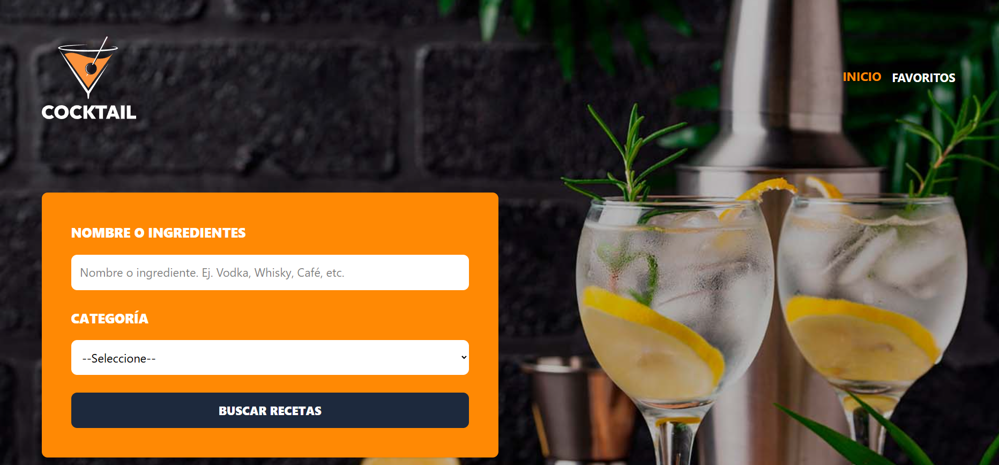
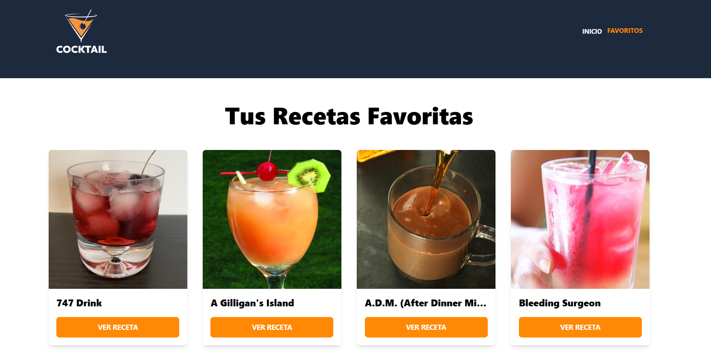
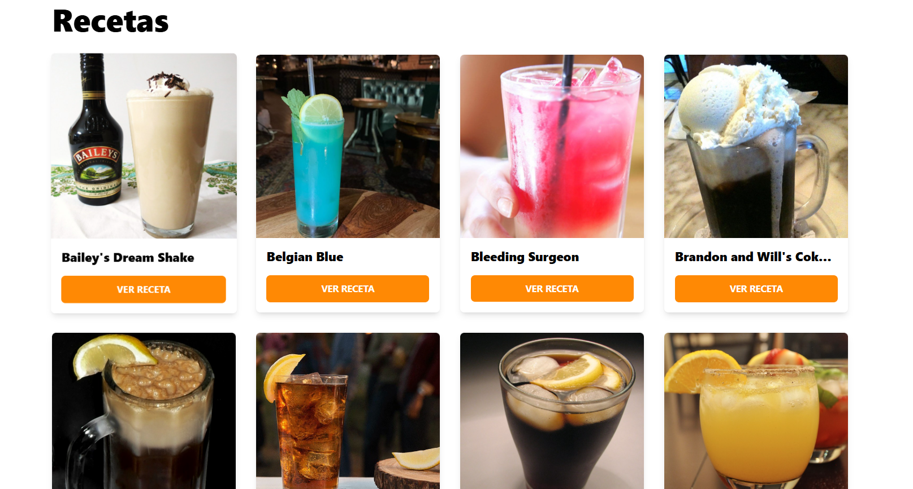
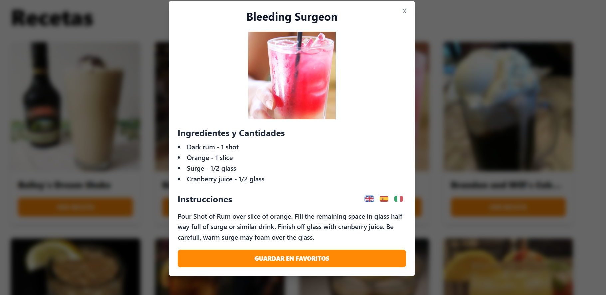
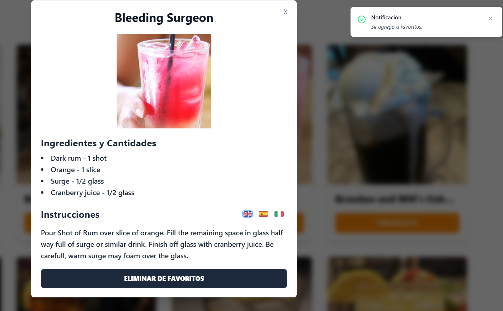

# 🍹 Buscador de Recetas de Bebidas API 🍸

Esta aplicación permite buscar recetas de bebidas y cócteles accediendo a datos de la API externa de Thecocktaildb. Fue construida con un stack moderno, usando React y TypeScript, integrando herramientas como Zustand para el manejo de estado global y Zod para la validación segura de datos, TailwindCss para el estilado y el manejo de vistas con React Router DOM.

## 🧪 Tecnologías utilizadas

- ⚛️ React
- 🟦 TypeScript
- ⚡ Vite
- 🎨 Tailwind CSS
- 🧭 React Router DOM
- 📦 Axios
- 🌐 Zod (validación de datos)
- 🧠 Zustand (estado global)
- 📘 ESLint + TypeScript Plugin
- 🖼️ Heroicons + Headless UI (íconos e interfaces accesibles)

## 🚀 Demo en vivo

👉 [https://buscador-bebidas-api-mc.netlify.app/](https://buscador-bebidas-api-mc.netlify.app/)

## 🖼️ Capturas

Inicio:

Favoritos:

Recetas:

